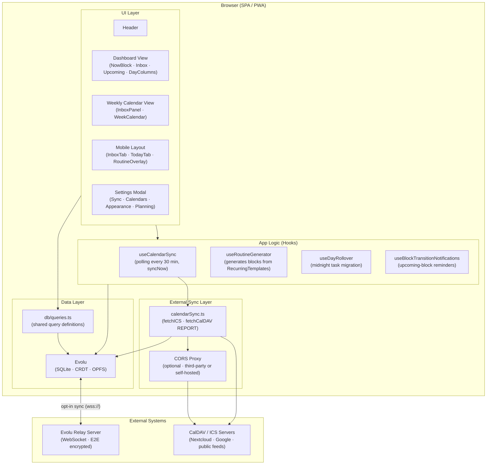
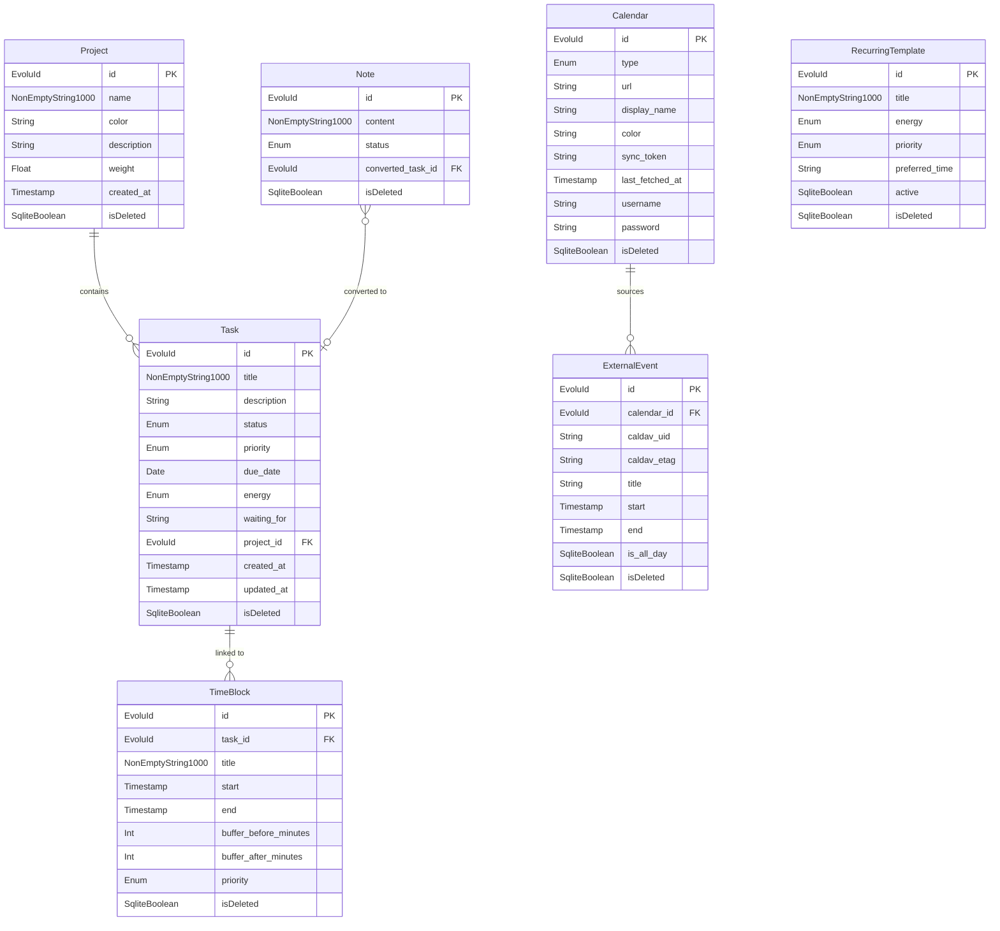
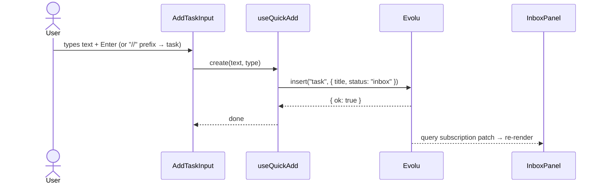
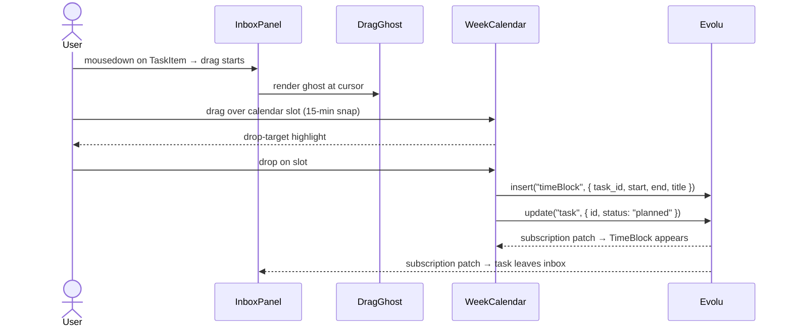
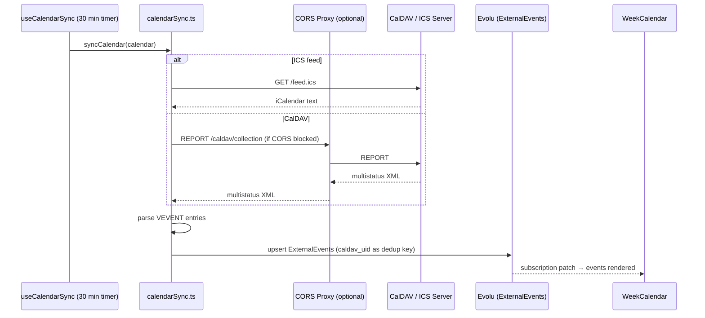

# FlowBlock — High-Level Design

**Version:** 0.1
**Status:** Draft
**Date:** 2026-04-14
**Source:** SPEC.md v0.29.0 → HLD

---

## 1. System Context

FlowBlock is a local-first, ADHD-friendly time-blocking planner that runs entirely in the browser. It combines a **unified inbox** (tasks and quick notes) with a **drag-and-drop calendar** for time-blocking, delivering a friction-free capture-and-plan loop without requiring an account or server. User data lives in a local SQLite database managed by Evolu; cross-device sync is opt-in and end-to-end encrypted. External calendars (CalDAV, ICS) are read-only bridges — FlowBlock never writes to them.

---

## 2. Component Map

### Components

| Component | Responsibility |
|---|---|
| **Dashboard View** | Default view: NowBlock (current/next time-block), Inbox, Upcoming, Projects, two narrow day-columns for planning |
| **Weekly Calendar View** | Full 5-day grid with Inbox panel left; primary surface for bulk planning |
| **Mobile Layout** | Touch-optimised two-tab layout (Inbox + Today) with FAB and bottom sheet for quick-add |
| **Settings Modal** | Sync toggle, Evolu identity (owner key export/import), custom relay URL, calendar management, appearance, planning preferences |
| **db/queries.ts** | Singleton `selectAll … where isDeleted is null` queries per table; shared across components to maximise subscription-cache reuse |
| **Evolu** | Local SQLite via OPFS, CRDT-based, E2E encrypted; the sole source of truth |
| **calendarSync.ts** | Fetches ICS feeds (HTTP) and CalDAV collections (REPORT request); upserts results as `ExternalEvent` rows in Evolu |
| **useCalendarSync** | Manages polling interval (30 min), exposes `syncNow()`, tracks per-calendar errors |
| **useRoutineGenerator** | Generates `TimeBlock` rows from active `RecurringTemplate` records at day rollover |
| **useDayRollover** | Detects midnight; migrates unfinished tasks silently (no "FAILED" state) |
| **useBlockTransitionNotifications** | Fires gentle reminders before upcoming block transitions |

---

## 3. Data Model

### Key Entities

| Entity | Role |
|---|---|
| **Task** | Unit of work; lifecycle: `inbox → planned → done` (or `someday`); never hard-deleted |
| **TimeBlock** | A scheduled slot on the calendar; may be linked to a Task or free-standing |
| **Note** | Lightweight capture (no priority/status/energy); lives in inbox until processed |
| **Calendar** | Config record for an ICS feed or CalDAV collection |
| **ExternalEvent** | Read-only mirror of external calendar events; never user-editable |
| **Project** | Optional grouping for Tasks with rotational weight (future feature) |
| **RecurringTemplate** | Defines a daily routine item; `useRoutineGenerator` materialises it into TimeBlocks |

**Soft-delete pattern:** All tables use `isDeleted: 0 | 1` (Evolu `SqliteBoolean`). Queries always filter `.where("isDeleted", "is", null)`.

---

## 4. Data Flow

### 4.1 Add task from Inbox

### 4.2 Drag task → TimeBlock (planning)

### 4.3 External calendar sync cycle

---

## 5. Technology Choices

| Decision | Choice | Rationale | Alternatives considered |
|---|---|---|---|
| **UI framework** | React 18 + TypeScript | Component model fits complex drag & drop and subscription-driven reactivity | Svelte (less ecosystem), Vue (team unfamiliarity) |
| **Local database** | Evolu (SQLite via OPFS + CRDT) | Offline-first, E2E encrypted multi-device sync, no backend required | IndexedDB (no SQL), PGlite (no built-in sync), Dexie (no CRDT) |
| **Query builder** | Kysely (via Evolu) | Type-safe SQL on top of Evolu's SQLite layer | Raw SQL strings (no type safety) |
| **Styling** | Tailwind CSS | Utility-first, no runtime overhead, fast iteration | CSS Modules (verbose), styled-components (runtime cost) |
| **Drag & drop** | HTML5 Drag API (custom) | No external dependency; full control over ghost rendering and snap logic | dnd-kit (large bundle), react-beautiful-dnd (deprecated) |
| **Calendar parsing** | ical.js | Battle-tested RFC 5545 parser for ICS/CalDAV VEVENT processing | ics (limited), hand-rolled parser (error-prone) |
| **CalDAV fetch** | Browser `fetch` + optional CORS proxy | ICS feeds work directly; CalDAV requires CORS workaround | Server-side proxy (adds backend requirement) |
| **Multi-device sync transport** | Evolu relay (WebSocket, E2E) | Zero-config for users; optional, user-controlled relay URL | Firebase (vendor lock-in), custom WebSocket server (maintenance) |
| **Deployment** | Static SPA + PWA manifest | No backend to maintain; works on Vercel/Netlify/nginx; installable | SSR (unnecessary complexity for local-first) |
| **Build tool** | Vite | Fast HMR, native ESM, simple config | Webpack (slower), CRA (deprecated) |
| **Tests** | Vitest | Same config as Vite; already in use for `lib/calendarLayout.ts` | Jest (separate config), no tests (risky for date/layout logic) |

---

## 6. Non-Functional Requirements

| Concern | How addressed |
|---|---|
| **Offline-first** | Evolu stores all user data in browser OPFS SQLite; app loads and functions with no network. Sync is opt-in. |
| **Privacy** | No account, no server-side user data. Evolu relay receives only E2E-encrypted CRDT deltas — relay cannot read content. Owner key never leaves the device unless user exports it. |
| **Performance** | Shared singleton queries in `db/queries.ts` maximise Evolu subscription-cache reuse, reducing redundant SQLite reads. Layout-heavy computations (collision detection) are isolated in `lib/calendarLayout.ts` and tested. |
| **ADHD UX** | Task capture < 3 seconds (inline input, no modal). Progressive disclosure (priority, energy, description hidden until needed). Silent task migration at midnight. Satisfying animations/sounds on task completion. Capacity bars prevent over-scheduling. |
| **Accessibility** | Full keyboard navigation in calendar popover (Tab flow, arrow keys for segments, Ctrl+Enter to save). Delete key for destructive action with inline confirm. Focus trapping in modals. |
| **Installability** | PWA manifest + service worker for install-to-homescreen and offline shell caching. |
| **Self-hostability** | Pure static build; users can serve from any web server. Evolu relay URL is configurable in Settings. |
| **Security** | Credentials (CalDAV username/password) stored only in Evolu local SQLite (E2E encrypted if sync enabled). CORS proxy is user-configured, not bundled. |

---

## 7. Open Questions & Risks

- `[QUESTION]` CalDAV write (creating TimeBlocks and Tasks on external CalDAV servers) — not in MVP, but the architecture must not preclude it. Should `calendarSync.ts` be split into `calendarReader.ts` + `calendarWriter.ts` when write support is added?
- `[QUESTION]` CORS proxy strategy: public proxy (e.g. `corsproxy.io`) vs. user-provided vs. bundled lightweight proxy. Decision deferred; currently documented as "user configures a public CORS proxy URL in Settings".
- `[QUESTION]` PWA service worker scope: which assets to precache? What's the cache invalidation strategy on deploy?
- `[QUESTION]` RecurringTemplate → TimeBlock generation: at what point in the day? At midnight rollover? On first app open of the day? Edge case: app not opened for multiple days.
- `[RISK]` **Evolu ProtocolQuotaError** — bulk import of ExternalEvents (511 rows observed) may exceed Evolu relay quota. Mitigations: batch inserts, sync disabled by default (already the case). Root cause not yet confirmed.
- `[RISK]` **Evolu subscription race on mount** — `useQuerySubscription` may return empty arrays for 1–2 renders after app load, causing ExternalEvents to appear missing on first load. Workaround: force `evolu.loadQuery(query)` in component `useEffect`. Long-term fix: centralised query pre-loading before first render.
- `[RISK]` **CalDAV CORS** — majority of CalDAV servers block cross-origin browser requests. ICS feeds are the reliable path; CalDAV is best-effort until a proxy strategy is decided.
- `[RISK]` **OPFS availability** — Evolu uses OPFS for SQLite storage; OPFS requires a secure context (HTTPS) and may be blocked in some private browsing modes. App should degrade gracefully (in-memory fallback via Evolu's built-in handling).
- `[RISK]` **Drag & drop on touch** — HTML5 Drag API is not supported on iOS Safari and most mobile browsers. Mobile drag & drop planning is intentionally excluded from MVP scope (mobile is capture-only).

---

_Generated by hld-create skill. To update this document, use the hld-update skill._
