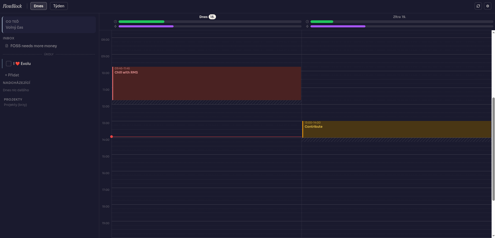
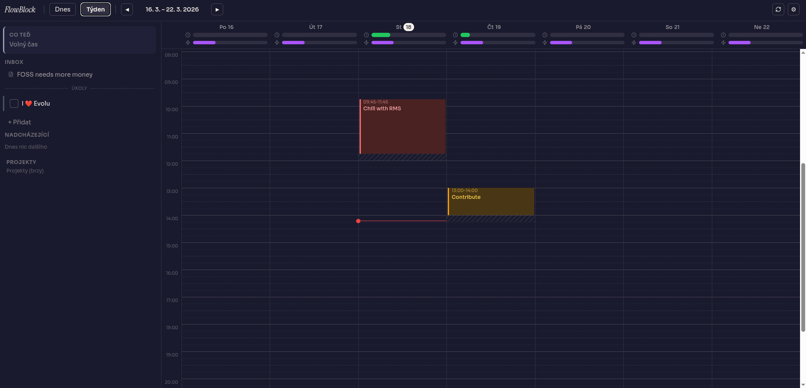

# FlowBlock

An Akiflow-inspired, local-first time-blocking planner built for ADHD brains.

Plan your day by dragging tasks into your calendar — no backend, no account required. Your data lives on your device.

## Features

- **Local-first** — data stored in local SQLite, never sent to a server; works fully offline
- **Device sync** — opt-in, end-to-end encrypted sync across devices via Evolu relay
- **Drag & drop** — drag tasks from inbox onto the calendar, resize blocks, drag back to unschedule
- **Time-blocking calendar** — week view and 2-day (today/tomorrow) dashboard view
- Inbox — capture tasks and quick notes (`//` prefix) in under 3 seconds
- Transition buffers — configurable breathing room between blocks
- Keyboard navigation — operate the full UI without a mouse
- Dark mode — warm paper-industrial aesthetic, light and dark
- Notifications — optional reminders before blocks end
- Priority system — color-coded none / low / medium / high

## Screenshots


*Dashboard view — today and tomorrow side by side*


*Week view — full 7-day calendar*

## Stack

| Layer | Technology |
|---|---|
| UI | React + TypeScript |
| Build | Vite |
| Local DB + sync | [Evolu](https://www.evolu.dev/) (SQLite + CRDT, E2E encrypted) |
| Styling | Tailwind CSS |

No backend is required. Everything runs in the browser.

## Getting started

### Prerequisites

- Node.js 18+
- npm, yarn, or pnpm

### Install and run

```bash
git clone https://github.com/nktrjsk/flowblock.git
cd flowblock
npm install
npm run dev
```

Open [https://localhost:5173](https://localhost:5173).

> The app requires a secure context (HTTPS or localhost). Serving over plain HTTP will break local storage and calendar sync features.

### Build for production

```bash
npm run build
```

Output goes to `dist/`. Deploy to any static host — GitHub Pages, Netlify, Vercel, etc.

## Deployment

### GitHub Pages

```bash
npm run build
# push dist/ to gh-pages branch, or use a GitHub Actions workflow
```

Live demo: [https://nktrjsk.github.io/flowblock](https://nktrjsk.github.io/flowblock)

## Keyboard shortcuts

| Action | Shortcut |
|---|---|
| Save time block | `Ctrl+Enter` |
| Delete time block | `Del` |
| Close popover / cancel | `Escape` |

## Sync between devices

FlowBlock uses [Evolu](https://www.evolu.dev/) for optional device sync. Sync is:

- **End-to-end encrypted** — the relay server sees only ciphertext
- **CRDT-based** — conflicts resolve automatically, no merge dialogs
- **Opt-in** — if you never set up sync, your data never leaves your device

To sync, open **Settings → Identity** and copy your owner key to the second device.

## CalDAV / ICS

> **Note:** This is an experimental, unreliable feature. Both ICS and CalDAV require a CORS proxy to work in the browser — direct fetches are blocked by browser security policy. Set up a proxy in **Settings → Advanced**.

You can overlay read-only events from external calendars:

1. Open **Settings → Calendars**
2. Add an ICS feed URL or a CalDAV server
3. Events appear in the calendar as dashed blocks beneath your time blocks

## Roadmap

- [ ] CalDAV write — sync time blocks back to CalDAV
- [ ] Projects — group tasks by project with rotational weight
- [ ] Energy capacity bar — plan by energy, not just time
- [ ] Routines — recurring time block templates
- [ ] Review mode — weekly retrospective view
- [ ] Smart suggestions — AI-assisted scheduling

## License

[WTFPL](LICENSE.md) — do what the fuck you want.
