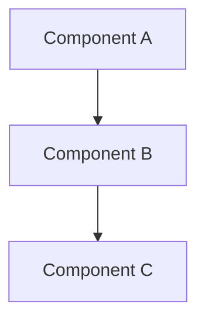
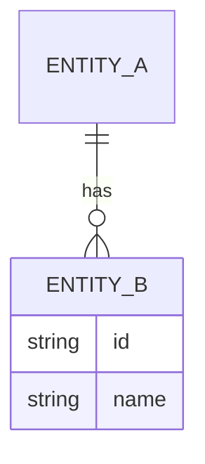
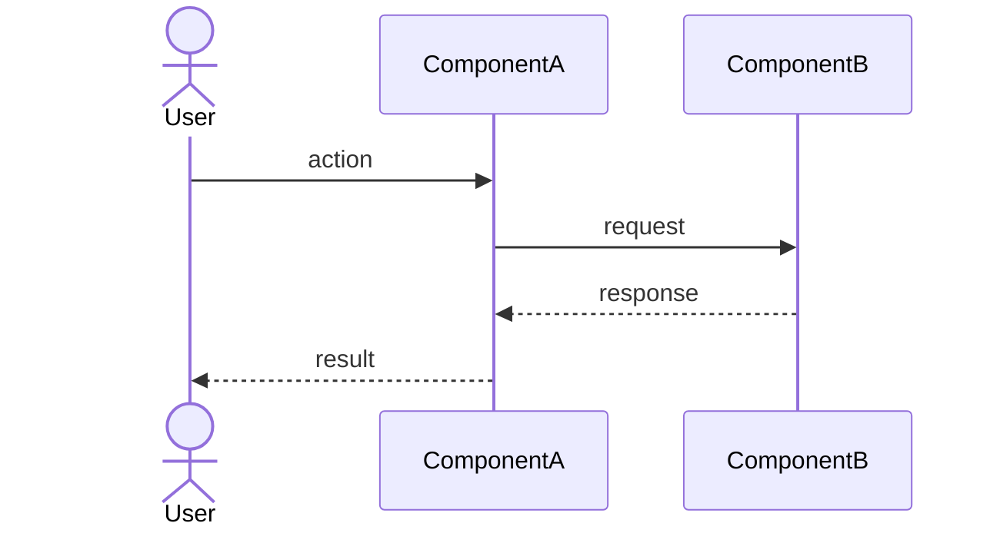

# HLD Create

**Language note:** Always respond in the user's language throughout the entire skill. If the conversation is in Czech, respond in Czech. If in English, respond in English.

## Purpose

Create a `DESIGN.md` — a high-level architectural document that bridges discovery (what and why) with implementation (how exactly). The output captures system shape: components, data model, interactions, tech choices, and open risks. It is **not** a spec for every function — it is the map of the territory.

---

## Phase 0 — Prerequisites Check

**Before anything else**, check whether `DISCOVERY.md` exists in the project directory.

```bash
ls DISCOVERY.md 2>/dev/null && echo "EXISTS" || echo "MISSING"
```

**If MISSING:** Stop immediately. Do not proceed. Tell the user:

> "Tento skill vyžaduje `DISCOVERY.md` jako vstup — bez něj nemám kontext o tom, co a proč stavíme. Spusť prosím nejdřív skill **discovery**, který ti pomůže tento soubor vytvořit, a pak se vrať sem."

_(In English: "This skill requires `DISCOVERY.md` as input — without it I have no context about what we're building and why. Please run the **discovery** skill first to create this file, then come back here.")_

**If EXISTS:** Read the full contents of `DISCOVERY.md`. Extract:

- Project name and one-line description
- Target users and their key pain points
- Prioritized features / scope
- Known constraints (tech, time, privacy, platform)
- Any open questions noted in discovery

Then proceed to Phase 1.

---

## Phase 1 — Clarifying Questions

Based on what you read from `DISCOVERY.md`, ask only the questions that are **not already answered there**. Do not re-ask things the file already covers. Ask all remaining questions in a single message.

Standard questions to check (ask only if unanswered in DISCOVERY.md):

1. **Deployment target** — Where will this run? (browser, desktop, mobile, server, Kubernetes, embedded?)
2. **Tech stack constraints** — Is there an existing stack to stay compatible with, or is everything open?
3. **Data persistence** — Where does data live? (local-only, cloud sync, self-hosted, none?)
4. **Auth / identity** — Does the system need authentication? If yes, any existing system to integrate with?
5. **Integrations** — Are there external services, APIs, or protocols that must be supported?
6. **Non-functional priorities** — Which matters most: offline-first, privacy, performance, simplicity, scalability? (Pick top 2)
7. **Team / solo** — Is this a solo project or a team? (Affects how much process overhead to design in)

---

## Phase 2 — Architecture Design

Design the system. Think through each section before writing. The goal is to be precise enough to be useful, and brief enough to stay readable.

### Sections to design:

**2.1 System Context**
One paragraph: what the system does, who uses it, what it replaces or supplements. Not a repeat of DISCOVERY.md — distill into a single architectural framing sentence.

**2.2 Component Map**
Identify the major components (modules, services, layers). For each:

- Name
- Responsibility (one sentence)
- What it depends on

Draw a Mermaid diagram showing components and their relationships:



**2.3 Data Model (high-level)**
Key entities and their relationships. Not a full schema — just the nouns that matter.

Draw an entity-relationship diagram using Mermaid:



**2.4 Data Flow**
How does data move through the system for the 2–3 most important user actions? Use a sequence diagram:



**2.5 Technology Choices**
For each major technology decision, state:

- What was chosen
- Why (one sentence)
- What alternatives were considered and why they were rejected

Use a table format for clarity.

**2.6 Non-Functional Requirements**
Address the top priorities identified in Phase 1. For each, one sentence on how the design satisfies it. Include: offline capability, data privacy, performance envelope, security surface, accessibility if relevant.

**2.7 Open Questions & Risks**
What is not yet decided? What could go wrong? Format as a list:

- `[QUESTION]` — What we don't know yet
- `[RISK]` — What might fail and why

---

## Phase 3 — Generate DESIGN.md

Generate the complete `DESIGN.md` file and write it to disk:

```bash
cat > DESIGN.md << 'ENDOFFILE'
[full content here]
ENDOFFILE
```

### DESIGN.md template:

```markdown
# [Project Name] — High-Level Design

**Version:** 0.1  
**Status:** Draft  
**Date:** [YYYY-MM-DD]  
**Source:** DISCOVERY.md → HLD

---

## 1. System Context

[One focused paragraph framing the system architecturally]

---

## 2. Component Map

[Mermaid graph diagram]

### Components

| Component | Responsibility |
| --------- | -------------- |
| ...       | ...            |

---

## 3. Data Model

[Mermaid ER diagram]

### Key Entities

[Brief description of each entity and why it exists]

---

## 4. Data Flow

### [Key User Action 1]

[Mermaid sequence diagram]

### [Key User Action 2]

[Mermaid sequence diagram]

---

## 5. Technology Choices

| Decision | Choice | Rationale | Alternatives considered |
| -------- | ------ | --------- | ----------------------- |
| ...      | ...    | ...       | ...                     |

---

## 6. Non-Functional Requirements

| Concern | How addressed |
| ------- | ------------- |
| ...     | ...           |

---

## 7. Open Questions & Risks

- `[QUESTION]` ...
- `[RISK]` ...

---

_Generated by hld-create skill. To update this document, use the hld-update skill._
```

---

## Phase 4 — Review Prompt

After writing the file, tell the user:

> "DESIGN.md jsem vytvořila. Projdi prosím dokument a dej mi vědět:
>
> - Co chceš změnit nebo upřesnit?
> - Jsou tam komponenty, které ti chybí nebo nedávají smysl?
> - Jsou technologické volby správně?
>
> Až budeš spokojená, použijeme **hld-update** na případné budoucí změny."

_(Adapt to English if conversation is in English.)_

Do not offer to rewrite the whole document — ask for specific feedback. Changes go through `hld-update`.
